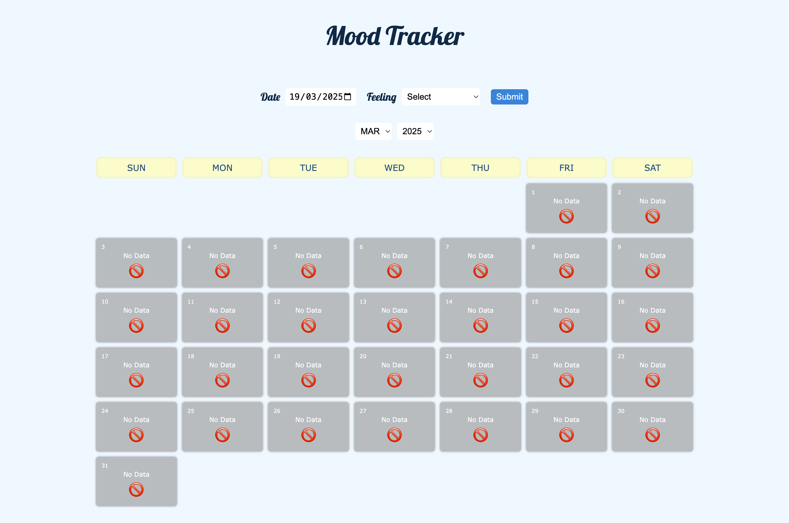
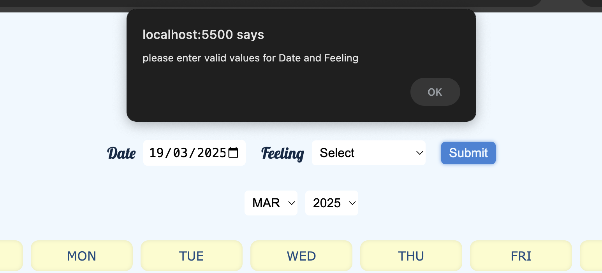
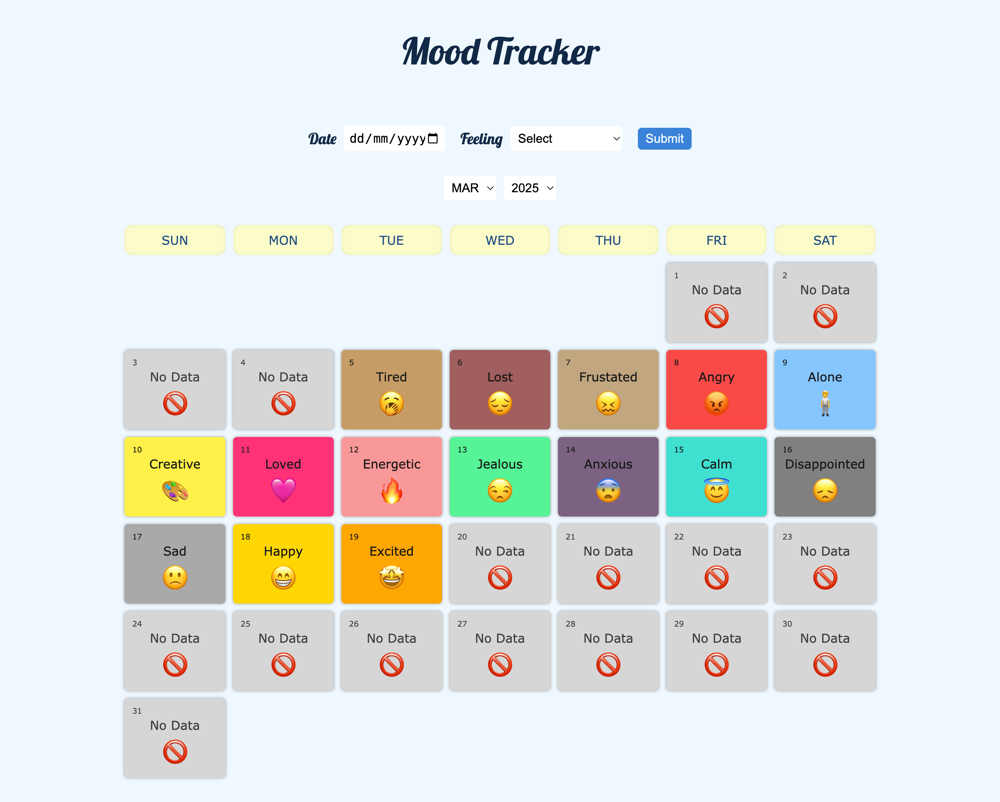

# Mood Tracker 🎭

A simple web browser application to keep track of your ___daily mood(feelings)___

---

## 🌟 Application Features

> * 📆 Shows the data in a **Calendar** view
> * ☑️ Many *Feeling options* to select from
> * 🎨 Visualize days in calendar with *different colors* for different feelings
> * 💾 Stores your data in your browser **localStorage** - persists data even if browser is refreshed or closed.

## 📸 Screenshots

1. Screen on load 

- Calendar displays with no data as card content.

2. Pops up a alert for invalid inputs

3. Once data is created and updated it looks like this

## 🔗 Deployment Link

[Github-Pages](https://bvvinaykumar45.github.io/mood-tracker)